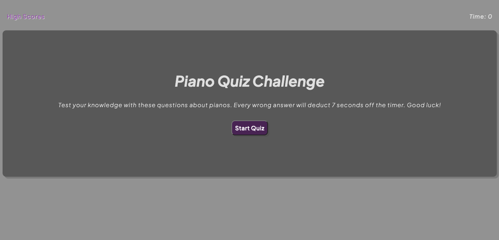

# piano-quiz
This is a timed quiz game about pianos.

I wrote the questions to this quiz in an array. Each index of the array contains an object that has the question, choices to pick, and the correct answer. I stored the choices in an array so that I could write a function to loop through all of the choices and compare it with the users pick.

It is complete with local storage to keep track of previous games scores.

When you click the start quiz button, I cleared the pages content using innerHTML = '', then use an index to keep track of the current question. Then I append the question, and wrote a loop for generating all the buttons.  When you start, the timer function is also started. With each incorrect guess, the timer goes down by 7 seconds.

Once a choice as been picks, resolveAnswer runs to check that the click events textContent matches with the key 'answer'. This function also checks if we are at the last question. If so, the page will prompt the user for their initials and then show them the list of high scores.

https://monacoglynn.github.io/piano-quiz/index.html

